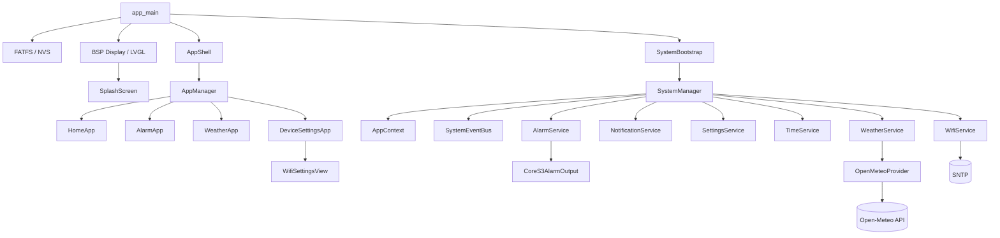
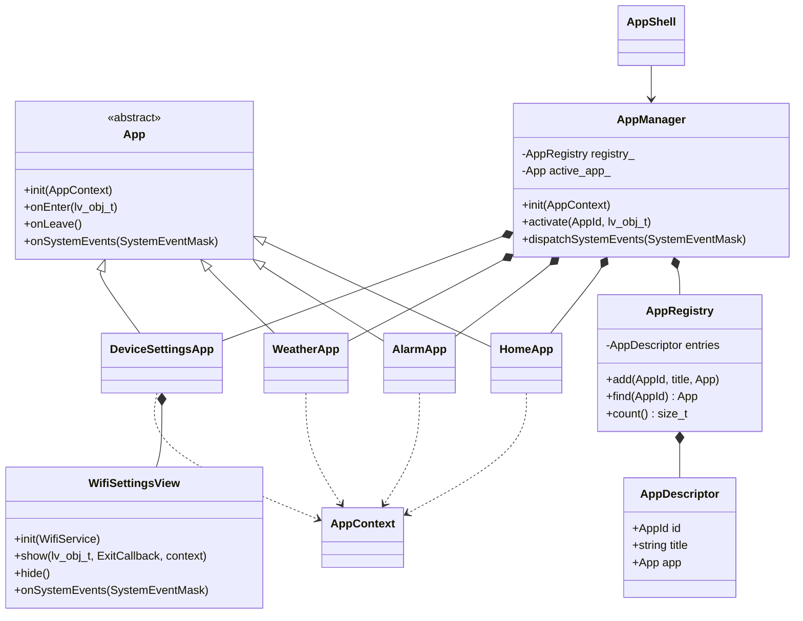
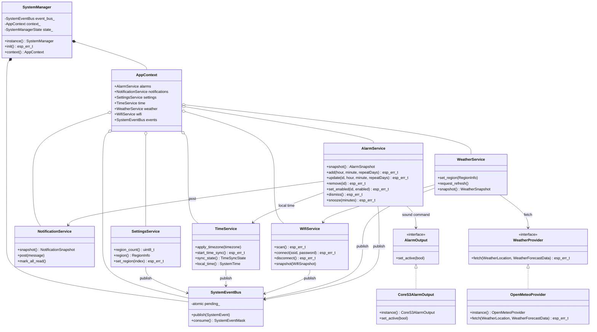
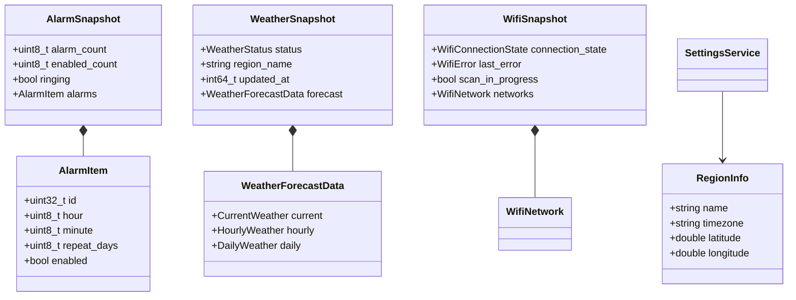
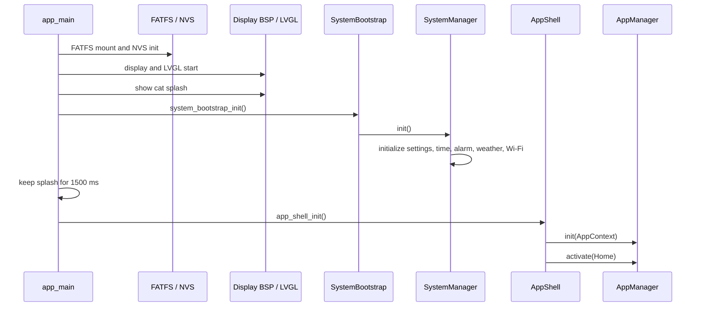
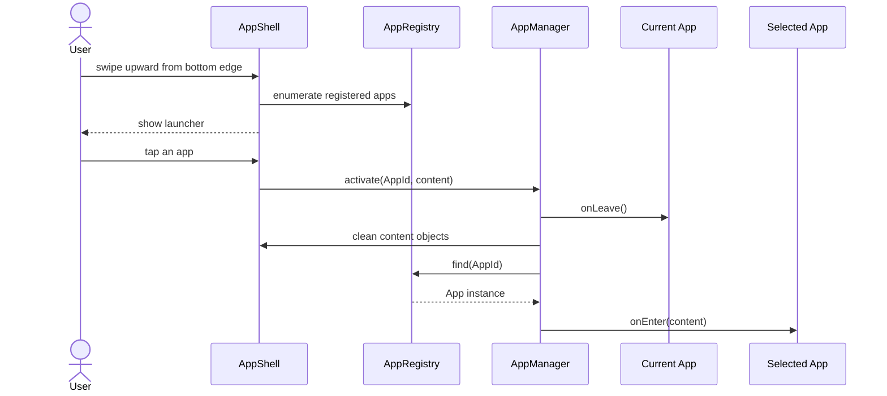
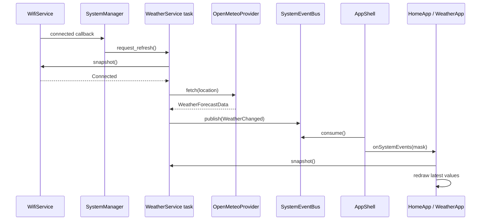
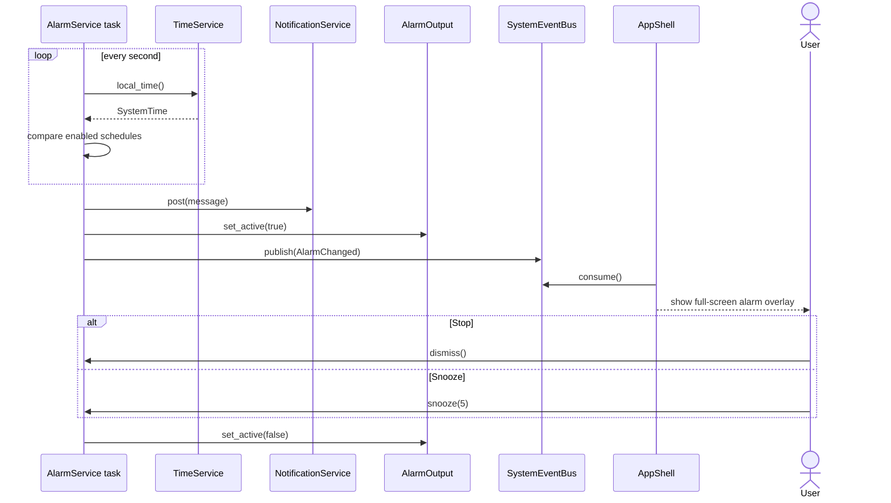
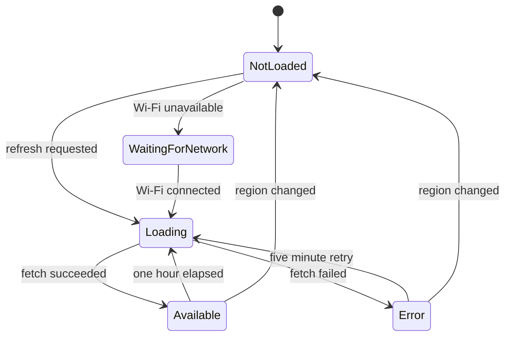
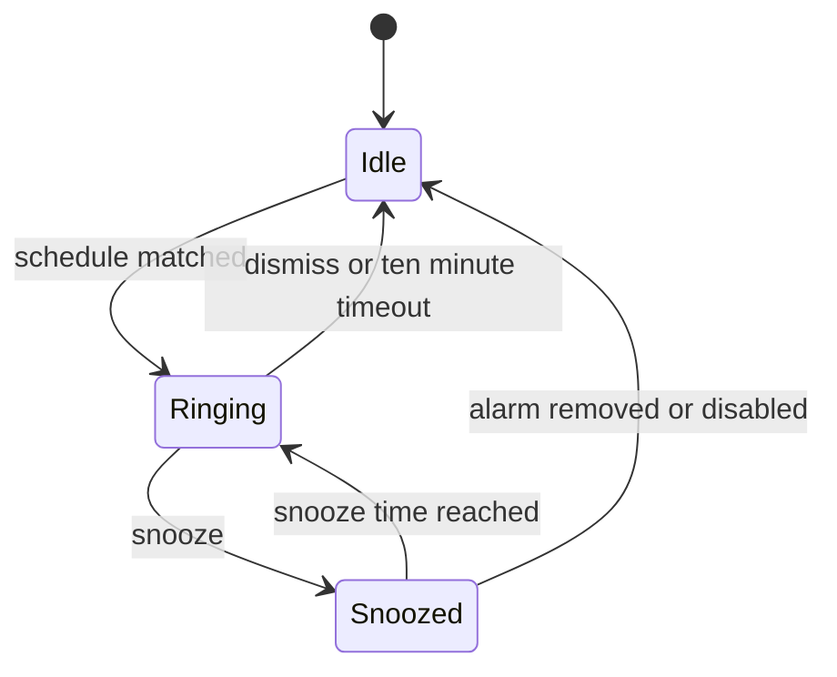

# Notificat UML 設計図

## この文書について

現在のソースコードを基準に、主要クラスの責務と実行時の連携を Mermaid で表現する。GitHub の Markdown 画面でそのまま描画できる。メンバー、引数、戻り値は設計理解に必要なものへ絞っており、完全な API 一覧ではない。実装と図が異なる場合はソースコードを正とする。

## システム構成

## UI クラス図

## サービスとプラットフォームのクラス図

## データモデル

## 起動シーケンス

## アプリ切替シーケンス

## 天気更新シーケンス

## アラーム発火シーケンス

## 天気サービス状態遷移

## アラーム実行状態遷移

## 設計上の制約

- LVGL API は UI タスクまたは LVGL lock 内からだけ操作する。
- サービスは UI オブジェクトを保持せず、値コピーの snapshot を公開する。
- FreeRTOS タスクと ESP イベントから更新する共有状態は mutex または atomic で保護する。
- HTTPS response や画像キャッシュは PSRAM を優先し、LCD/SPI DMA 用の内部 RAM を残す。
- アプリの追加・削除は `AppManager`、`AppRegistry`、`AppContext`、ビルド対象、文書を同時に更新する。
